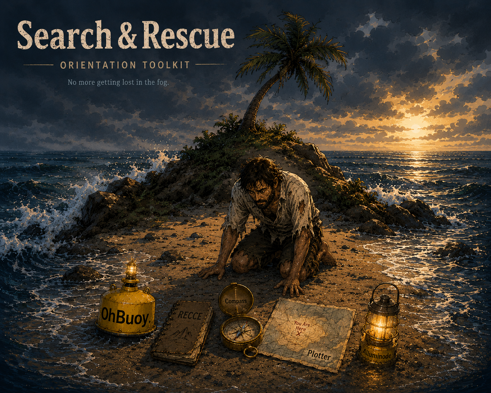

# Search and Rescue (S+R)



Search and Rescue (S+R) is the full NodAIity orientation toolkit.

It brings together independently wieldable instruments for continuity, reconnaissance, bearing, position, and posture. Use one instrument or combine the smallest useful set for the terrain.

```text
OhBuoy     -> Is the route alive?
RECCE      -> What is actually out there?
Compass    -> Which way should I face?
Plotter    -> Where am I?
AIluminode -> How should I proceed?
```

This repository contains the runnable OhBuoy implementation, full-stack documentation, release-hardening evidence, and supporting research notes.

Related standalone tools:

- [OhBuoy](https://github.com/SuperHeroesAreReal/ohbuoy)
- [AIluminode](https://github.com/SuperHeroesAreReal/AIluminode)

---

## Runnable Continuity Instrument

OhBuoy is a lightweight continuity scanner.

It is not observability tooling, telemetry, distributed tracing, dashboards, AI orchestration, network surveillance, or infrastructure crawling.

Audits tell you what exists. OhBuoy tells you what happens along declared terrain.

Core question:

```text
Is the route alive?
```

Core loop:

```text
scan
packet
render
release
```

V0 doctrine:

```text
ping before ponder
no answer is an answer
minimal memory is sacred
the scanner must float above terrain, not become the terrain
```

---

## Install S+R Runtime Surface

S+R is the full orientation toolkit. The current runnable runtime surface in this repository is the OhBuoy CLI, which carries the continuity scanner plus Compass and AIluminode scan modes.

Build the local S+R CLI runtime:

```powershell
.\gradlew.bat :cli:installDist
```

Run the S+R continuity scanner:

```powershell
.\cli\build\install\ohbuoy\bin\ohbuoy.bat startup
```

Equivalent scan form:

```powershell
.\cli\build\install\ohbuoy\bin\ohbuoy.bat scan startup
```

Optional AIluminode posture scan mode in this repo:

```powershell
.\cli\build\install\ohbuoy\bin\ohbuoy.bat eeg "Refactor Paula EPUB source handling without touching memory save logic"
```

---

## Related Toolkit

OhBuoy is an independently deployable continuity instrument and a pane in **Search and Rescue (S+R)**, the full NodAIity orientation toolkit.

S+R combines independently wieldable orientation panes without turning them into a fixed pipeline or shared runtime. Use OhBuoy alone when the question is route continuity; use the smallest useful Glass Stack when the terrain needs more illumination.

Toolkit questions:

```text
OhBuoy     -> Is the route alive?
RECCE      -> What is actually out there?
Compass    -> Which way should I face?
Plotter    -> Where am I?
AIluminode -> How should I proceed?
```

No tool here is a required dependency of another tool. Each instrument should still make sense by itself.

Glass Stack doctrine:

```text
No pane owns the terrain.
No pane owns another pane.
Use the smallest set of panes needed before action.
```

Route polarity is a corridor, not a blindfold.

The scanner is operationally blinkered but architecturally peripheral-aware: it narrows action to declared terrain while still allowing side-door observations to be reported as evidence.

Blocked terrain prevents implementation drift. It does not erase architectural awareness.

Stable corridors need lighter orientation overhead. Uncertain, dark, or stale terrain should trigger a fresh Compass and AIluminode posture check before action.

```text
if terrain feels stale
→ ping orientation again
→ refresh route polarity
→ act only inside the updated corridor
```

---

## Side Corridor Doctrine

Models are often capable of solving adjacent corridor problems.

Capability is not authorization.

The existence of a valid side-corridor fix does not make that fix the current objective.

When a side corridor is observed:

```text
Leave a sign.
Follow the pressure.
```

Orientation provides illumination. Orientation does not provide permission.

Blinkers do not reduce awareness. They prevent awareness from becoming unauthorized inference.

Models may observe adjacent terrain, but they may not reason over or act inside unauthorized corridors.

Awareness is preserved. Action is constrained.

S+R reduces inference spent on unauthorized corridors, adjacent objectives, speculative fixes, terrain rediscovery, and grand unified cleanup attempts. Reasoning pressure stays focused on the active objective.

Side-corridor observations should not be discarded. They may be preserved as Plotter markers, Librarian notes, or future Collector relevance links.

The side door is not entered now. The sign remains for later.

Packet metric:

```text
Corridors Observed: X
Corridors Entered: Y
```

Desired outcome:

```text
Observed > Entered
```

A clean S+R run should demonstrate broad awareness and narrow execution. RECCE bleed is indicated when unauthorized observed corridors become entered corridors.

Compressed doctrine:

```text
Observe broadly.
Reason narrowly.
Act locally.
Leave a sign.
Follow the pressure.
```

Librarian and Collector remain outside the S+R instrument stack as governance/archive postures.

Full note: [Side Corridor Doctrine](docs/Side%20Corridor%20Doctrine.md)

---

## Example Output

```text
TRACE startup_4812

AUTH ✓
TENANT ✓
GOVERNANCE ⚠
NAVIGATION ⛔

HOWLER:
Governance degradation propagated downstream.
```

Available modes:

```text
startup
login
governance
navigation
```

AIluminode's internal EEG mode emits a compact contextual posture trace:

```text
EEG TRACE eeg_1234

ACTIVE_TERRAIN:
- paula_memory_pipeline
- source_terrain
- codebase

STANCE:
surgical_refactor

COMPASS_GUIDANCE:
- route=paula_memory_pipeline
- howler=RECENT_SQLITE_MEMORY bypasses STANCE_GATE and TERRAIN_GATE.
- likely_fix=Move recent memory retrieval behind topology filtering.

ROUTE_POLARITY:
- OPEN: current_prompt (declared task is the active entry point)
- OPEN: bounded_source_index (source terrain is active; use bounded source access)
- PROTECT: saved_memory (saved_memory is named under a protection/avoidance phrase)
- AUDIT: compass:prompt_assembly (Compass target for observed propagation drift)
- DEFER: vector_memory (vector_memory is not needed for this task)
- BLOCK: autonomous_crawling (AIluminode stays declared-terrain only)

OPEN_ROUTES:
- current_prompt
- paula_memory_files
- bounded_source_index
- declared_code_surface

PROTECT:
- saved_memory

AUDIT:
- compass:prompt_assembly

DEFER:
- archive_logs
- vector_memory
- full_source_ingestion
- dashboard

BLOCK:
- autonomous_crawling
- telemetry_empire

DRIFT_RISK:
- source_terrain_mistaken_for_memory

NEXT_SAFE_ACTION:
Protect saved memory; inspect adjacent route logic without modifying it.
```

---

## Compass

Compass compares declared propagation routes.

It does not inspect projects, crawl repositories, chase runtime links, or decide terrain vocabulary. The route must be declared first.

Run the Paula memory pipeline report:

```powershell
.\cli\build\install\ohbuoy\bin\ohbuoy.bat compass paula_memory_pipeline
```

Expected shape:

```text
COMPASS REPORT paula_memory_pipeline

EXPECTED:
USER_INPUT
→ STANCE_GATE
→ TERRAIN_GATE
→ BLOCKERS/SIGNPOSTS
→ FILTERED_RECENT_MEMORY
→ BOUNDED_RETRIEVAL
→ TOPOGRAPHY_PACKET
→ MODEL_PROMPT
→ MODEL_RESPONSE
→ SQLITE_MEMORY_WRITE

OBSERVED:
USER_INPUT
→ TOPOGRAPHY_PACKET
→ RECENT_SQLITE_MEMORY
→ MODEL_PROMPT
→ MODEL_RESPONSE
→ SQLITE_MEMORY_WRITE

HOWLER:
RECENT_SQLITE_MEMORY bypasses STANCE_GATE and TERRAIN_GATE.
```

---

## Boundaries

OhBuoy observes declared terrain only.

It must never become an autonomous topology crawler. It does not chase unknown links, discover infrastructure, retain operational data, ingest telemetry, or build dashboards.

The scanner emits bounded continuity packets, renders operational orientation, and releases the data.

AIluminode follows the same boundary. Its internal EEG mode observes contextual posture before action; it does not read files, retain prompts, retrieve memory, or modify terrain.

Side-door observations may inform a report, but they do not grant permission to widen the implementation route.

Dynamic re-orientation is preferred over stretching an old packet across changed terrain.

Unknown terrain is a first-class state:

```text
unknownTerrain
-> route not registered
-> position uncertain
-> bearing unavailable
-> stop propagation
-> report state
```

---

## RECCE

RECCE is the field discipline around OhBuoy.

```text
observe
orient
report
disappear
```

Scouts do not start building towers because the view is nice.

RECCE marks continuity fracture zones without fixing, rewriting, or occupying terrain.

Run RECCE doctrine tests:

```powershell
.\gradlew.bat :core:test
```

---

## Instrument Shape

```text
ohbuoy = observes terrain
Compass = compares expected and observed propagation
RECCE = proves field discipline
Plotter = position instrument
AIluminode = public posture-before-action orientation instrument
EEG = internal AIluminode scan mode for route polarity
```

---

## Release Evidence

Current release evidence:

- [S+R Release Hardening](docs/S+R%20Release%20Hardening%201.md)
- [S+R Test 1: Prove Orientation](docs/S+R%20Test%201.md)
- [S+R Test 2: Measure Work Saved](docs/S+R%20Test%202.md)
- [S+R Test 3: Doctrine Propagation](docs/S+R%20Test%203.md)

Current caveat:

```text
Current results demonstrate behavior change before retrieval and early work-reduction signals.
They do not yet support broad drift-reduction claims.
```

---

## Research Notes

Supporting research and historical validation material lives in `docs/` and is not required to use S+R:

- [Branch A background research](docs/BranchA.md)
- [OhBuoy V0 development record](docs/OhBuoyV0.md)
- [OhBuoy V2 Compass development record](docs/OhBuoyV2.md)
- [AIluminode development record](docs/AIluminode.md)

---

## Keywords

search and rescue, S+R, AI orientation toolkit, AI navigation, developer tools, context engineering, context governance, continuity tracing, operational topology, system propagation, runtime continuity, auth drift, topology mapping, trace analysis, operational GIS, fracture detection, startup sequencing, navigation continuity, systems topography, orientation-first systems, cognitive orientation, orientation before retrieval, pre-retrieval orientation, pre-reasoning orientation, posture-before-action, cognitive posture, route polarity, bounded action, contextual routing, context drift, contextual orientation, retrieval governance, retrieval pressure, memory weighting, drift reduction, route discipline, terrain-aware systems, unknownTerrain, OhBuoy, RECCE, Compass, Plotter, AIluminode

---


```text
Good luck sailor.
```
